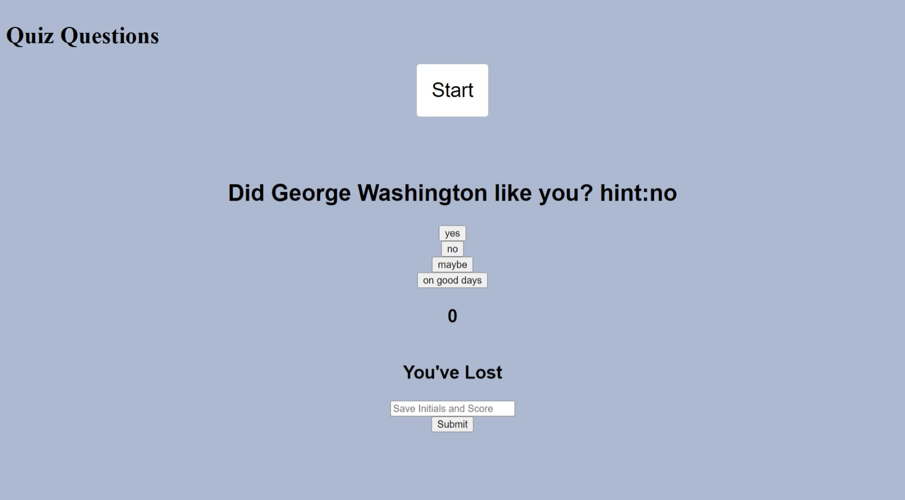

## Name

Quiz game.

## Description

This quiz game starts with the start button. (I was unable to accomplish a "hidden" feature with it unlike the other elements.) You answer questions about how early presidents thought of you. A timer starts and time is added or subtracted based on your correct answer. The final time is the final score. It is saved with your initials.

## Visuals

Basic CSS style.

#https://janorris65.github.io/HW4/

# Usage

Simply answer questions.

## Project status

again the start button hidden feature didnt come across and a form submission to add questions was part of the project design but not implemented.
